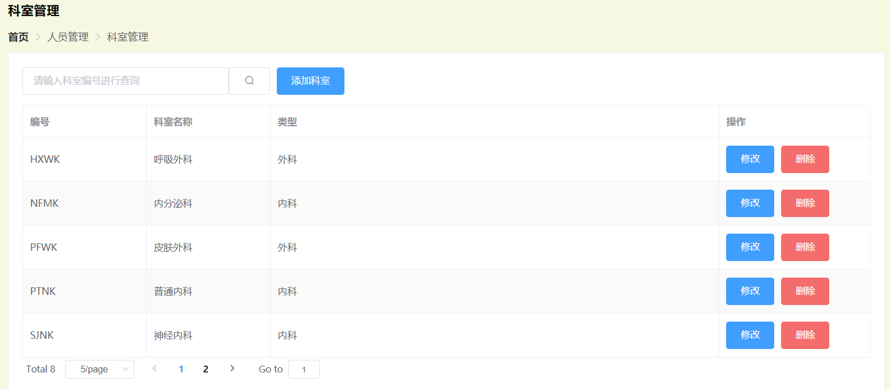

一些可能会用到的：

### 分页查询所有

使用pagehelper实现：

* 配置pom.xml

```
<dependency>
    <groupId>com.github.pagehelper</groupId>
    <artifactId>pagehelper-spring-boot-starter</artifactId>
    <version>1.2.5</version>
</dependency>
```

* 使用,前端get时传递pagenum，pageSize参数，即可实现分页。

```java
@GetMapping("/allDep/{pageNum}/{pageSize}")
public PageInfo<Department> selectByPage(@PathVariable int pageNum, @PathVariable int pageSize){
    PageHelper.startPage(pageNum, pageSize);
    List<Department> depList = departmentDao.getAllDep();
    PageInfo<Department> pageInfo = new PageInfo<>(depList);
    return pageInfo;
}
```

### 分页实现模糊查询

模糊查询语句：

```sql
@Select("select * from department where id like '%${id}%'")
```

传递参数时换一种方式，传递整个对象

controller中：

```java
@GetMapping("/allDep")
    public PageInfo<Department> selectByPage(QueryInfo queryInfo){
        PageHelper.startPage(queryInfo.getPageNum(), queryInfo.getPageSize());
        List<Department> depList = departmentDao.getAllDep(queryInfo.getQuery());
        PageInfo<Department> pageInfo = new PageInfo<>(depList);
        System.out.println(queryInfo);
        return pageInfo;
    }
```

前端传参：

```javascript
 async getDepList(){
            const {data: res} = await this.$http.get("/allDep",{params:this.queryInfo});
     //传参格式要注意一下
            this.tableData = res.list;
            this.total = res.total;
        },
```

6.30实现的：

实现了增删改查、以及模糊分页查询



7.3实现：

用户管理增删改查

排班表功能实现
